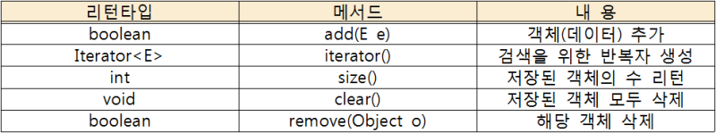

## JAVA Set interface 

### 1.특징
        - 객체를 중복해서 저장할 수 없다.
        - 저장 순서를 보장하지 않는다 ( = 인덱스로 조회 불가능)
        - ! 객체를 중복해서 저장하지 않으므로 중복 제거를 할때 유용하다.

### 2. 메서드


### 3. HashSet
        - 데이터의 중복을 허락하지 않음 
        - 조회를 위해서는 iterator 를 사용해야함

```java
    public class class1 {
    
    
        Iterator<String> it = set.iterator(); // Iterator(반복자) 생성

        while(it.hasNext()){ // hasNext() : 데이터가 있으면 true 없으면 false
            System.out.println(it.next()); // next() : 다음 데이터 리턴
        }
    }

```

### 4. TreeSet
    - 기본적으로 HashSet과 유사하나 TreeSet은 오름차순으로 데이터를 정렬하는 특징이 있다.


### 5. LinkedHashSet
    - 다른 클래스들과 차이점은 입력된 순서를 유지한다는 것이다.